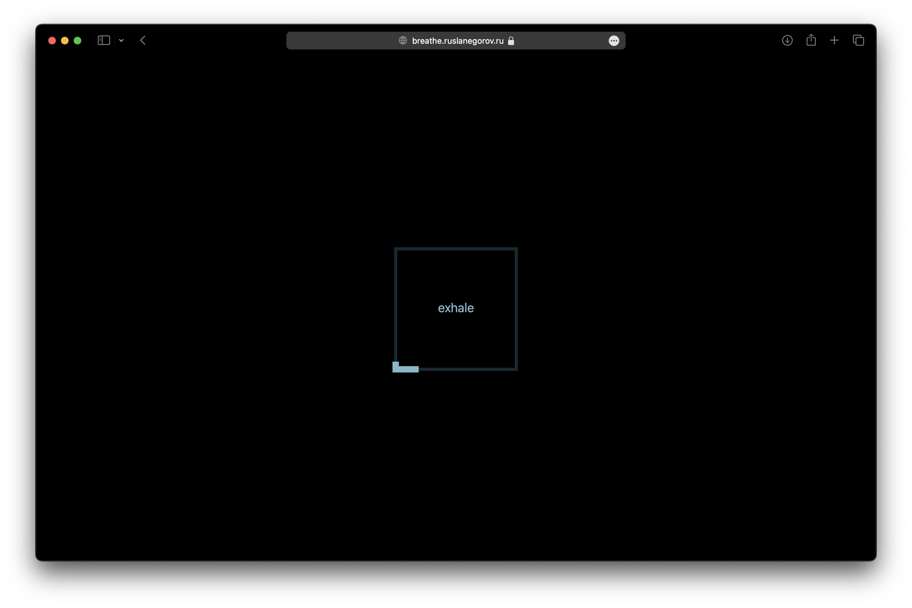

# box breathing

The four stages speak for themselves: inhale-hold-exhale-hold.

## Tech used

* Plain JavaScript `<canvas>`
* Canvas scaled to `devicePixelRatio`
* Hosted on GitHub Pages
* Built with vite
* Works offline with vite-plugin-pwa
* ESLint and Prettier
